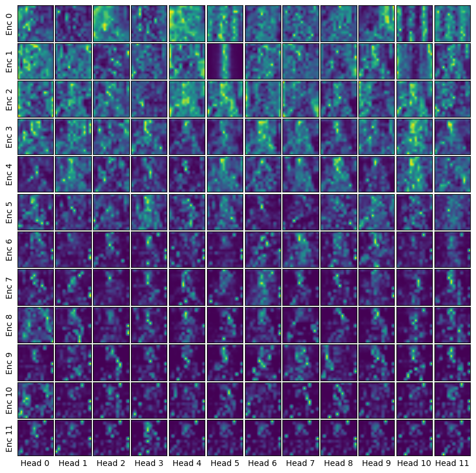
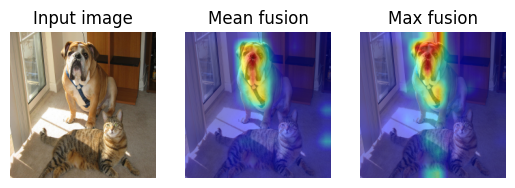
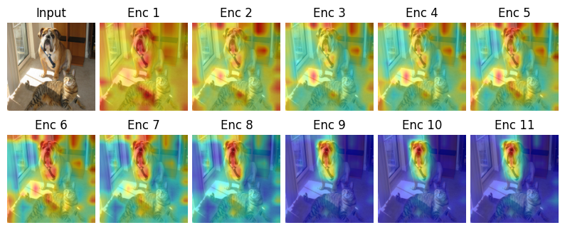

# Understanding attention through XAI in Vision Transformers
## Project Summary
Deep Learning course final project at FRI-ULJ. The project is about getting a better intuition regarding attention through Explainable AI methods, specifically for Transformers in Computer Vision. The models looked at are the ViT and Swin Transformer models. The methods used are attention visualizations, information flow visualization with attention rollout, some LIME testing to see what features the model focuses on and some manual image slicing that tests how size and location of objects effects predicted classes. The project also includes some fine-tuning of the said models, but it's not the main point of the report, more-so bonus content.

The full report can be read [here](/doc/Attention_in_CV_Through_XAI_NejcL.pdf). Bellow are some example images from the report.

## Example images
An example of attention visualization:

An example of attention rollout: 

An example of attention rollout through the model:

